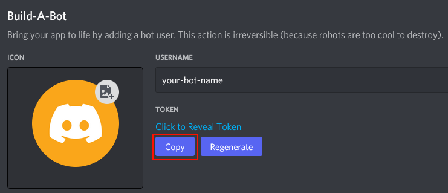
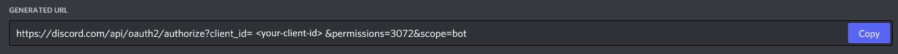
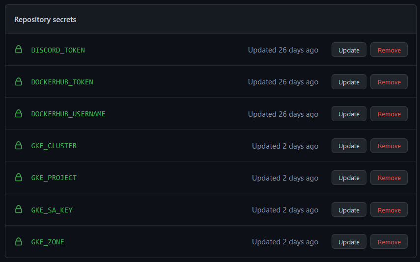

# Project documentation
On this page we describe the the tools we used to set up our project. More concretely,
we cover the following topics:

1. [Project introduction](#introduction)
2. [Vertical scaling of individual microservice](#vertical-scaling-of-individual-microservice)
3. [Using an ingress controller for service communication](#using-an-ingress-controller-for-service-communication)

## Introduction
As our project for the computing project course we create a Discord bot that can perform different actions 
based on users commands. As an example, we could ask the bot for the current time

or to perform simple calculations


The bot can be deployed on a Kubernetes cloud, and each available command is handled by a specific microservice. 
Moreover, new microservices can simply be added by changing the Kubernetes configuration. This enables easy and
fast development of new services.


### Github actions pipeline
We use Github Actions to automatically create and update images for our microservices and to deploy them to a Kubernetes cluster.
In general, once the master branch is updated by e.g. a commit, the following actions will be performed:
1. Master branch is checked out
2. An individual image for each microservice is built
3. The images are published to DockerHub.
4. Previous deployments on the Kubernetes cloud are stopped (necessary for our ingress configuration)
5. Finally, the bot and its microservices are deployed to the cloud.

You can also check out the [CI.yml](.github/workflows/CI.yml) file for the complete list of executed commands.


### Prerequisites
To be able to automatically deploy and use our bot, we need to create a few different accounts, as instructed below.

1. Discord bot
	Having a Discord bot is the main prerequisite for a working setup. The bot will later communicate will later listen
	to user commands and respond to them. In the following we will guide you through the process of setting up a bot:
	
	a. Create a new Discord application at https://discord.com/developers/applications
	b. Head to the 'Bot' settings and click `Add Bot`
	c. A new 'bot' user should have been created.
	d. Copy the access token and add it as `DISCORD_TOKEN` in your Github secrets.
	
	e. To add your application to a server, you need to create a URL for it. Therefore, head to the `OAuth2/URL Generator` tab 
	and check all scopes and bot permissions that your app must have on a server. In our case the scope is simply `bot` and for
	our easy examples we only require the roles `Send Messages` and `Read Messages`. A URL will then be generated below, which 
	you can open to select the server you want to add your bot to.
	
	
	For more information about Discord, using applications and bots, you may also want to read up on the official [Discord documentation](https://discord.com/developers/docs/intro).
	

2. Dockerhub
	We will use Dockerhub to publish docker images of our microservices, which we can then later deploy to Kubernetes.
	a. Generate an Dockerhub access token at https://hub.docker.com/settings/security
	b. Add your Dockerhub user name as the `DOCKERHUB_USERNAME` secrets
	c. Add your Dockerhub access token (that you just created) as `DOCKERHUB_TOKEN`
	

3. Kubernetes
	We also need to have access to a Kubernetes cluster where we can deploy our bot and microservices. We choose [Google Cloud](https://cloud.google.com/)
	as it offers limited free free services for new customers. 

	a. Log into Google Cloud (or create an account if you don't have one yet) and follow the instructions [here](https://cloud.google.com/resource-manager/docs/creating-managing-projects?hl=de) to create a new project.
	b. As we are using Github Actions, we need to create a service account (SA) to manage Kubernetes via the console. Follow [this](https://cloud.google.com/iam/docs/service-accounts) documentation to create a new SA and add its key as secret `GKE_SA_KEY` to Github secrets. 
	c. We now set up a new Kubernetes cluster by following the [these](https://cloud.google.com/tools/powershell/docs/container?hl=de) instructions.
	d. Add the project id, the cluster name and the zone the cluster is deployed to as the Github secrets `GKE_PROJECT`, `GKE_CLUSTER` and `GKE_Zone`, respectively.
	
We end up with the following secrets in Github. Please check whether all are present for your configuration, as they are all required.



## Vertical scaling of individual microservice

### Summary of research

The vertical pod autoscaler (VPA) allows to update the assigned resources for pods based on load. This is mostly done by changing the `resources` field in deployment specs.
The resources field tells Kubernetes how much load we are gonna expect for a single pod. Setting this manually can be hard, but it is useful to set it properly, 
because it allows Kubernetes to schedule pods on hosts where the required resources are available. 

The vertical pod autoscaler is a Kubernetes component that is not part of the default Kubernetes setup, so it usually needs to be installed or activated manually.
It consists of three main components:
* **Recommender**: This VPA component queries load metrics for running pods from the Kubernetes metrics server and creates recommendations for those. Sometimes this component is all one is interested in, as the recommendations can be manually put into deployment specs as well, without relying on the updater and admission controller at all.
* **Updater**: The VPA updater is responsible for updating the `resources` field of pods based on the recommendations. It runs every minute and if the current load is outside the lower or upper bound of the recommendation, it evicts the currently running pod and starts a new one with an updated `resources` field. Note that at least 2 healthy replicas need to be running for automatic updates. Local tests have shown that we actually need 3 replicas, such that one can be evicted, as 2 are still running then.
* **Admission controller**: This VPA component is responsible for assigning VPA instances to pods. 

Sometimes it is not necessary to automatically update the `resources` field, but to only set the initial value properly. Then, we might want to take a look at the recommendation for current load, by using the command `kubectl describe vpa <vpa-name>`. There you can see the recommended values for the assigned deployment.

### Setup a VPA for a new microservice

Each microservice deployment can have an accompanying Vertical Pod Autoscaler (vpa) configured. The VPA's are set to automatically update the pods based on the load.

Example:
```
apiVersion: "autoscaling.k8s.io/v1"
kind: VerticalPodAutoscaler
metadata:
  name: stress-vpa
spec:
  targetRef:
    apiVersion: "apps/v1"
    kind: Deployment
    name: python-stress-service
  updatePolicy: 
    updateMode: Auto
  resourcePolicy:
    containerPolicies:
      - containerName: '*'
        controlledResources: 
          - cpu
```

The update mode is set to 'Auto', which enables the VPA updater to terminate and spin up new pods with the recommended CPU values set.

### Deployment configuration notes
* Each deployment requires its own VPA configuration. There is no support for selectors that would allow one VPA for multiple deployments.
* At least 3 replicas are required in the deployment to support automatic updating of pods.
* For trying it out locally, it is recommended to set the `cpu` value to `1m`. The service is set up as a web service that will only execute load when requests are generated. Usually, when trying this out locally, it can take a bit to start up everything and also execute requests. If one sets the value too high, it might be the case that VPA does not update in the first run and then refrains from updating for many hours as the upper bound is set too high. More on that later in the **Findings** section.

### Tutorial (for trying it out locally)
We advise for a local test with only the `stress` microservice, as it is hard to show quick reactions of the VPA in a running environment. We focus on a tutorial with `minikube`.

* **Note for `minikube` users:** VPA is not part of minikube by default, therefore one needs to manually install it by following the instructions [here](https://github.com/kubernetes/autoscaler/tree/master/vertical-pod-autoscaler#installation).
* **Note for `minikube` users:** The VPA relies on the metric server to get recent CPU and memory values. The metric server is disabled by default in minikube. You can enable it with ```minikube addons enable metrics-server```.

1. Switch to the `microservices/stress` directory.
2. Apply the deployment and load balancer with `kubectl apply -f deployment_local.yaml`. The local version has no placeholders that need to be filled and no support for ingress. We don't apply the VPA yet, 
to generate load first and later let the VPA get load metrics which already 
show high load.
4. **Note for `minikube` users:** Start a tunnel with `minikube tunnel`.
5. **Note for `minikube` users:** Expose the load balancer in minikube with `minikube service k8s-lb-stress -n k8s-discord`. This should automatically open a browser window for the local URL. If not, copy the local URL into a new browser tab, e.g. 'http://127.0.0.1:60771'. You can check if you did everything correctly until now and that the service is accessible by calling your local URL on the path '/stress/health' - if you get a 200 response, everything works. 
6. Generate some load by accessing this URL with a request, e.g. `http://127.0.0.1:60771/stress?data=10m%208p`. Do this in a few tabs, e.g. 5, to make sure that all replicas get some load.
7. Execute `kubectl top pods -n k8s-discord` and wait for the metric server to get recent metrics for all pods that show that they execute load.
8. Look at one of the pods that is returned with `kubectl get pods -n k8s-discord` with `kubectl describe pod <pod> -n k8s-discord` and check the assigned CPU resources. It should be `1m`.
9. Apply the `vpa.yaml` with `kubectl apply -f vpa.yaml`.
10. Execute `kubectl get pods -n k8s-discord` a few times until you see pods being terminated and new ones spun up.
11. Execute `kubectl describe pod <pod> -n k8s-discord` for one of the new ones. You should see a higher CPU value now. Note: Sometimes, this takes up to a few minutes.


### Summary of lessons learned
Initially, we believed that we can use the VPA as a quick remediation action against spikes in load, but the VPA is not designed for fast actions and therefore not well-suited to react to spikes in load quickly.

A pod is only updated, if the recommended CPU and memory values are below the lower bound or greater than the upper bound. These bounds are implemented to scale with time, so the shorter a pod is running, the less eager the VPA is with updating the pods with new recommended values. This can be seen in the [implementation](https://github.com/kubernetes/autoscaler/blob/d81bdb87ce5d6801d0030f02c2e96080b53a209e/vertical-pod-autoscaler/pkg/recommender/logic/recommender.go#L28) of the recommender.
Especially, when trying to showcase VPA for a low-request web-service - which we have in our project, this can be a hassle.

This behavior can also be noticed with the logs that one can see by checking the logs for the vpa-updater pod, e.g.:  
```I0102 23:45:23.825037       1 update_priority_calculator.go:133] not updating a short-lived pod default/python-stress-service-6cbbcb9477-c2878, request within recommended range```

Also, it was interesting to find that we need at least 3 replicas running such that the VPA updater automatically updates the pods. If we redid our project, we would probably opt for microservices that are only started when they are needed (like FaaS), and then set the VPA mode to 'initial'. With this mode we would correctly measure the load required, i.e. when a query is executed and not measure the load when no queries are being executed, as it is done now. We would also avoid terminating running executions and only set the CPU and memory sizes upon creation of pods.

## Using an ingress controller for service communication
For our architecture we decided to combine an ingress controller (for routing) with multiple
cluster-ip services to expose the microservice deployments to our main service. This way we can map bot commands
to corresponding microservices by specifying path rules in our ingress.yaml.

TODO: general way service set up, deployment, ingress


### Trying it out locally with minikube:

1. Start minikube

```bash
minikube start
```

2. Enable the ingress addon

```bash
minikube addons enable ingress
```
4. Apply the services and deployment YAML for each microservice 

```bash
kubectl apply -f /micorservices/echo/deployment.yaml
...
```
5. Apply the ingress for local deployment 
```bash
kubectl apply -f ingress_local.yaml
```
6. Open the cluster IP combined with a service path (e.g. 192.168.49.2/time) to see if the service work properly.

Automation: We automated steps 4-5 to make the deployment task less tedious.
Local deployment for minikube can be applied by using the ``./deployment.sh``
script by setting the TARGET to 'local'. This way it is not necessary to replace
all the placeholders set in the different YAMLs.

Note: at first it was our intention that ingress needs a specified host that's
why we set up ingress-dns by following this guide: [Ingress DNS](https://minikube.sigs.k8s.io/docs/handbook/addons/ingress-dns/).
We configured our in-cluster dns to enable our enabling services to reach others
using ingress routing: [Customizing DNS Service](https://kubernetes.io/docs/tasks/administer-cluster/dns-custom-nameservers/).
Later we found out that by dropping the 'host' entry in the ingress.yaml we can
just use the default cluster IP of minikube.
To get this IP you can run the following command:

```bash
minikube ip
```

Ingress for local deployment (ingress_local.yaml):
```yml
apiVersion: networking.k8s.io/v1
kind: Ingress
metadata:
  annotations:
    kubernetes.io/ingress.class: nginx
  name: discord-ingress
  namespace: k8s-discord
spec:
  rules:
  - http:
      paths:
      - backend:
          service:
            name: k8s-service-main
            port:
              number: 7000
        path: /register
        pathType: Prefix
      - backend:
          service:
            name: k8s-service-echo
            port:
              number: 8080
        path: /echo
        pathType: Prefix
      - backend:
          service:
            name: k8s-service-math
            port:
              number: 8080
        path: /math
        pathType: Prefix
      - backend:
          service:
            name: k8s-service-time
            port:
              number: 8080
        path: /time
        pathType: Prefix
      - backend:
          service:
            name: k8s-service-binary
            port:
              number: 8080
        path: /binary
        pathType: Prefix
```
Looking at the above YAMl it can be noticed that we defined a path and a backend service for
and the corresponding port for each microservice that we want to access via our ingress controller.

Microservice deployment/service YAML:
```yml
apiVersion: v1
kind: Service
metadata:
  name: k8s-service-time
  namespace: k8s-discord
  annotations:
    cloud.google.com/neg: '{"ingress": true}'
spec:
  selector:
    app: microservice-time
  ports:
    - protocol: TCP
      port: 8080
      targetPort: 7002
---

apiVersion: apps/v1
kind: Deployment
metadata:
  name: microservice-time
  namespace: k8s-discord
spec:
  replicas: 1
  selector:
    matchLabels: 
      app: microservice-time

  template:
    metadata:
      labels:
        app: microservice-time
    spec:
      containers:              
        - name: microservice-time
          image: <DOCKER_USER>/microservices-time:<TAG>
          env:
            - name: INGRESS_HOST
              value: "http://<INGRESS_IP>/"
            - name: MICROSERVICE_PORT
              value: "7002"
          ports: 
            - containerPort: 7002
          readinessProbe:
            httpGet:
              path: /time/health
              port: 7002
            initialDelaySeconds: 5
            periodSeconds: 5
```
As you can see in the above yaml we created a (ClusterIP) service with a specific selector to identify the correct
deployment of the actual application. The deployment itself has a label that corresponds to the selector of the service.
For reference, we link to the [Labels and Selectors](https://kubernetes.io/docs/concepts/overview/working-with-objects/labels/)
in the kubernetes documentation.

Two additional points of interest are the service annotation "cloud.google.com/neg: '{"ingress": true}'" and the
definition of a readinessProbe within our deployment. As both of them are more important for the deployment in gcloud
we will discuss this points in more detail within the next section.

## Deploying our architecture to gcloud

We decided to use ingress-gce instead of nginx-ingress for the deployment in the
gcloud GKE kubernetes cluster as the initial setup is easier.

Unfortunately, this decision lead to many drawbacks as ingress-gce is not as
straight-forward and doesn't provide an easy setup for features like path
rewrite. Another drawback is the documentation which in its size is quite good
however it lacks a clear structure which resulted in many hours wasted to find
out why something does not work as its intended. A particular good example for
this would be that nginx-ingress expects that the wired/linked service defined
in its configuration.

Provide a health check by offering a health resource as it's creating LoadBalancers (called backend services) for each of them.
If the health resource is not returning an HTTP 200 status code GKE considers the backend service as unhealthy and the ingress routing does not work.
The preferred setup is still unclear to us, however we got it working by
specifying readinessProbes for our deployments as described at
[ISSUE-20555](https://github.com/kubernetes/kubernetes/issues/20555#issuecomment-326058311).
First, we deployed our ingress-gce in an external manner (meaning it is publicly
accessible) as stated at
[Ingress for External HTTP(S) Load Balancing](https://cloud.google.com/kubernetes-engine/docs/concepts/ingress-xlb).
However, this was inappropriate approach as there is also the option of setting
up an internal ingress, is a more concise for our use case as only
cluster-internal services (bot-command microservices) should have access.
However, the setup of an internal ingress is quite tricky as custom subnets have
to be specified within gcloud.
After some hours of tinkering we finally could manage to set it up internally as
 described at [Ingress for Internal HTTP(S) Load Balancing](https://cloud.google.com/kubernetes-engine/docs/concepts/ingress-ilb).

### Setting up the environment for an internal ingress

1. create network:

```bash
gcloud compute networks create lb-network --subnet-mode=custom
```

2. create subnet for service backends:

```bash
gcloud compute networks subnets create backend-subnet \
    --network=lb-network \
    --range=10.1.2.0/24 \
    --region=europe-west4
```

3. create proxy-only-subnet for INTERNAL_HTTPS_LOAD_BALANCER:

```bash
gcloud compute networks subnets create proxy-only-subnet \
  --purpose=INTERNAL_HTTPS_LOAD_BALANCER \
  --role=ACTIVE \
  --region=europe-west1 \
  --network=lb-network \
  --range=10.129.0.0/23
```

4. set up firewall rules:

```bash
gcloud compute firewall-rules create fw-allow-ssh \
    --network=lb-network \
    --action=allow \
    --direction=ingress \
    --target-tags=allow-ssh \
    --rules=tcp:22
```

```bash
gcloud compute firewall-rules create fw-allow-health-check \
    --network=lb-network \
    --action=allow \
    --direction=ingress \
    --source-ranges=130.211.0.0/22,35.191.0.0/16 \
    --target-tags=load-balanced-backend \
    --rules=tcp

```

```bash
gcloud compute firewall-rules create fw-allow-proxies \
  --network=lb-network \
  --action=allow \
  --direction=ingress \
  --source-ranges=10.129.0.0/23 \
  --target-tags=load-balanced-backend \
  --rules=tcp:80,tcp:443,tcp:8080
```

5. set up cluster

```bash
gcloud container clusters create discord-cluster \
    --enable-ip-alias \
    --zone=europe-west1-b \
    --network=lb-network \
    --subnetwork=backend-subnet
```

6. setup of a static IP for the ingress (Reference: 
[Reserving a static internal IP address](https://cloud.google.com/compute/docs/ip-addresses/reserve-static-internal-ip-address)):
```
gcloud compute addresses create static-ingress-ip --region europe-west4 --subnet backend-subnet --addresses 10.1.2.10
```
NOTE: the static-ip name (in the above case static-ingress-ip) must be set as  the value of the 'kubernetes.io/ingress.regional-static-ip-name' within the ingress.yaml to ensure that the ip is actually set for the internal ingress. if the value contains a value the ingress will still be deployed but of course will not work.


### Deploying the internal ingress
The deployment steps for gcloud are similar to those of
1. Apply deployment/service YAMLs
2. Apply ingress YAML

We recommend using the deployment.sh script for gcloud as it prompts
for parameters that it set automatically in all the YAMLs.
It should also be noted that it is possible to deploy our architecture
by using GitHub Workflow.
Ingress for gcloud deployment (ingress_gcloud.yaml):
```yml
apiVersion: networking.k8s.io/v1
kind: Ingress
metadata:
  name: discord-ingress
  namespace: k8s-discord  
  annotations:
    kubernetes.io/ingress.class : "gce-internal"
    kubernetes.io/ingress.regional-static-ip-name: "static-ingress-ip" 
spec:
  rules:
    - http:
        paths:
          - path: /register
            pathType: ImplementationSpecific
            backend:
              service:
                name: k8s-service-main
                port:
                  number: 7000 
          - path: /echo
            pathType: ImplementationSpecific
            backend:
              service:
                name: k8s-service-echo 
                port:
                  number: 8080
          - path: /math
            pathType: ImplementationSpecific
            backend:
              service:
                name: k8s-service-math 
                port:
                  number: 8080
          - path: /time
            pathType: ImplementationSpecific
            backend:
              service:
                name: k8s-service-time
                port:
                  number: 8080
          - path: /binary
            pathType: ImplementationSpecific
            backend:
              service:
                name: k8s-service-binary
                port:
                  number: 8080
```
As we already did in the first section we want to provide a deeper understanding of the ingress yaml above.
In contrast to the YAML for the minikube deployment we can notice that the ingress metadata contains
two additional annotations:
- kubernetes.io/ingress.class : "gce-internal"
- kubernetes.io/ingress.regional-static-ip-name: "static-ingress-ip"

The 'ingress.class' annotations states that GKE should create an ingress controller for cluster internal usage and the 
'ingress.regional-static-ip-name' annotation specifies which gcloud address should be used as a static address for the ingress instance.

In addition, also the PathType of the defined paths changed from Prefix to ImplementationSpecific this is a must-have
if you want to use the gce-ingress.

We also want to refer to the deployment/service yaml of the first section and go into more detail about the following subjects:
- cloud.google.com/neg annotation
- readinessProbe

As a gce-internal requires the service backends to be NEGs the following annotation is needed in the deployment/serivce YAML:
```yml
  ...
  annotations:
    cloud.google.com/neg: '{"ingress": true}'
  ...
```
For more detail on why this is necessary we want to refer to the following documentation: [Deploying a Service as a Network End Group](https://cloud.google.com/kubernetes-engine/docs/how-to/internal-load-balance-ingress#deploy-service)

As already stated in the introduction of this section GKE is in the need of a health endpoint for each service/application.
For more information have a look on this page of the kubernetes documentation: [Configure Liveness, Readiness and Startup Probes](https://kubernetes.io/docs/tasks/configure-pod-container/configure-liveness-readiness-startup-probes/)
